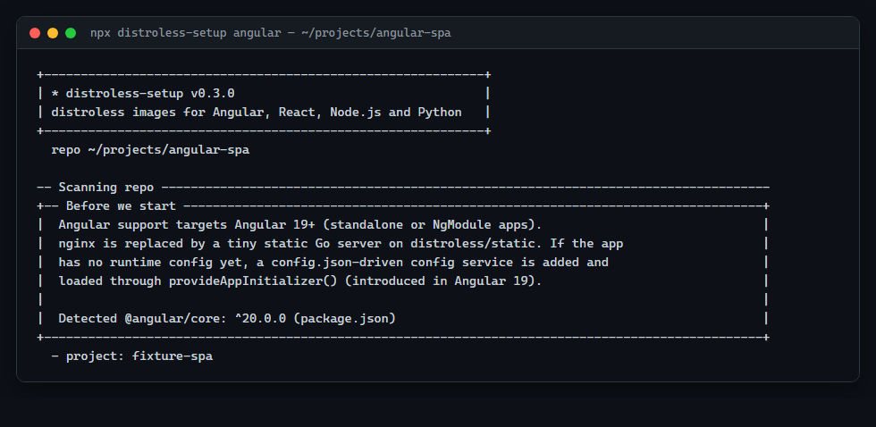
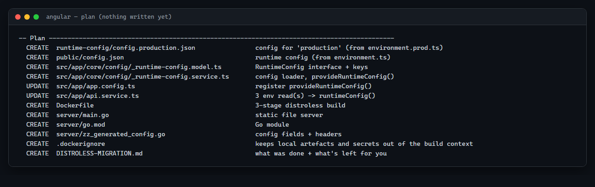
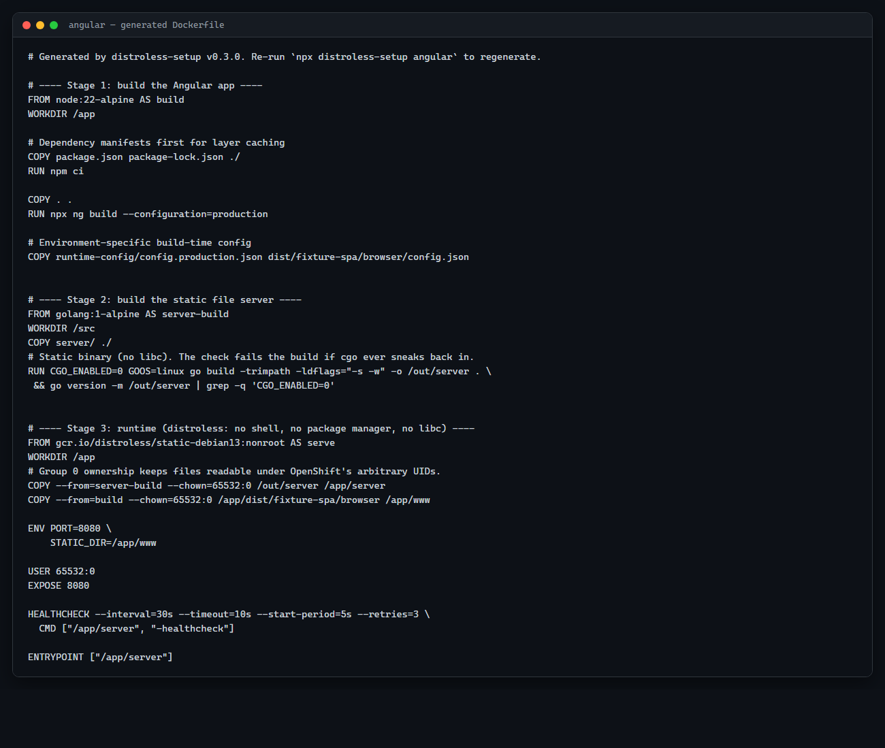
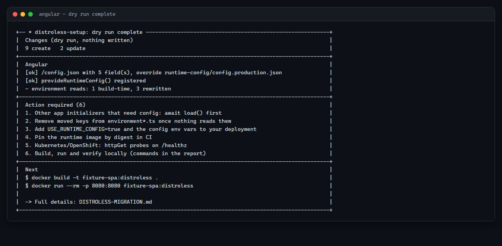
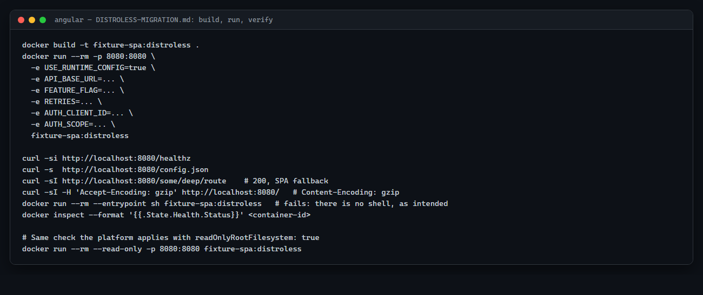

# Angular walkthrough

This walkthrough follows `npx distroless-setup angular` end to end on a real Angular 19+
SPA, using the same fixture project the tool's own test suite builds and runs
(`test/fixtures/angular-spa` in this repository). Everything shown here — the prompts, the
generated `Dockerfile`, and the migration report — is the tool's actual output, not a
mock-up.

## What you'll do

Run the CLI against an Angular app, answer its questions (or accept the defaults), review
the plan it shows you, apply it, then build, run and verify the resulting container image.

## What you'll end up with

- A multi-stage `Dockerfile` that compiles your Angular app, compiles a small Go static file
  server, and assembles a final image on `gcr.io/distroless/static-debian13:nonroot` — no
  nginx, no Node.js, no shell, running as a non-root user.
- Optionally, a `config.json`-driven runtime configuration system, so the same image can run
  in dev/staging/prod with different settings, without a rebuild.
- A `DISTROLESS-MIGRATION.md` report documenting exactly what changed and what's left for
  you to do.

## Before you start

You'll need:

- **Angular 19 or newer.** The image-only setup (no runtime config) works on any Angular
  version the tool can detect, but the runtime-config integration relies on
  [`provideAppInitializer()`](https://angular.dev/api/core/provideAppInitializer), which was
  introduced in Angular 19. If your app is older, the CLI still offers to set up the
  container image; it just skips the config rewiring.
- **Node.js 18.17+** to run the CLI itself, and Docker to build and run the image. The
  Angular project's own Node version is chosen separately, for the build stage only (see
  below) — Node never ships in the final image.
- A terminal in your Angular project's root (where `angular.json` lives).

A few terms that come up throughout this guide:

> [!NOTE]
> **Build stage** vs **runtime image**: a distroless Dockerfile has more than one `FROM`
> line. Early stages ("build stages") have a full OS and toolchain to compile your app; only
> their *output* — compiled files, not the toolchain — is copied into the final, minimal
> "runtime image" that actually ships. Angular's Dockerfile has three stages: compile the
> Angular app, compile the Go server, then assemble the runtime image from both outputs.

## 1. Prepare your project

No preparation is required — you can run the tool against an existing Angular project as-is.
It reads `angular.json`, your `environment.ts` files and any existing nginx configuration; it
changes nothing until you approve a plan, and every file it overwrites or removes is backed
up to `.distroless-backup/<timestamp>/` first.

If you'd rather not touch a real project yet, clone this repository and point the CLI at
`test/fixtures/angular-spa` — that's the exact project this guide uses.

## 2. Run distroless-setup

From the project root:

```bash
npx distroless-setup angular
```

Naming `angular` skips auto-detection; leaving it out also works, since the presence of
`angular.json` alone is enough for the tool to detect an Angular project with full
confidence. Add `--dry-run` the first time if you just want to see the plan and generated
`Dockerfile` without writing anything:

```bash
npx distroless-setup angular --dry-run
```

The tool opens with a banner and a scan of your repo:

```
◆ distroless-setup v0.3.0
distroless images for Angular, React, Node.js and Python

  repo /path/to/angular-spa

── Project type ──────────────────────────────────────────────
  • detected: Angular  (angular.json)
  ? Set up a distroless image for this Angular project? [Y/n]:
```

## 3. Understand each CLI question

The questions arrive in the order below. Every one has a default in `[brackets]` — pressing
Enter accepts it, and `--yes` accepts every default non-interactively (useful in CI or for a
quick dry run).

### Angular version and project

```
╭── Before we start ────────────────────────────────────────────╮
│ Angular support targets Angular 19+ (standalone or NgModule   │
│ apps). nginx is replaced by a tiny static Go server on        │
│ distroless/static. If the app has no runtime config yet, a    │
│ config.json-driven config service is added and loaded through │
│ provideAppInitializer() (introduced in Angular 19).           │
│                                                                │
│ Detected @angular/core: ^20.0.0 (package.json)                │
╰────────────────────────────────────────────────────────────────╯
  ? Continue with Angular 20? [Y/n]:
```



| What it's asking | Recommended | Change this when | What happens |
|---|---|---|---|
| Whether to proceed, given the detected Angular version | Accept (`Y`) if the version shown is 19+ | The version is below 19, or wasn't detected: you're offered image-only setup, "treat it as 19+", or abort | Below 19, choosing image-only skips **all** runtime-config prompts; only the Dockerfile and server get generated |

If your workspace defines more than one Angular application in `angular.json`, you're also
asked **"Which Angular project should the image serve?"** — one image serves one
application. The fixture has a single project (`fixture-spa`), so this question is skipped
entirely; with one match, the tool proceeds without asking.

### Build stage

| Prompt | What it's asking | Recommended | Change this when | What happens |
|---|---|---|---|---|
| `Dependency install command` | The command that installs `node_modules` in the build stage | Accept the detected default (`npm ci`, `pnpm install --frozen-lockfile`, or the Yarn equivalent, based on your lockfile) | You use install flags your CI also needs (e.g. a private registry auth step handled elsewhere) | Becomes the `RUN` line right after `COPY package.json <lockfile>` in the Dockerfile |
| `Node image for the build stage` | Which Node.js image compiles the app | The detected major version (from `.nvmrc`, `.node-version`, `package.json#engines.node`, or `22` as a fallback) on `-alpine` | Your build needs glibc-only native tooling (Angular's own toolchain doesn't) | Sets the first `FROM` line; this Node.js **never ships** — it only exists to run `ng build` |
| `Build configuration` | Which `angular.json` build configuration to use (only asked when more than one exists and no prior Dockerfile set one) | `production` (or whatever `defaultConfiguration` names) | You have a distinct configuration for containers specifically | Feeds the `--configuration=<name>` flag on the build command and picks which `fileReplacements` apply |
| `Build command` | The exact command run to produce the build | The generated `npx ng build --configuration=production` (prefixed with your `prebuild` script if `package.json` has one) | You need extra flags (`--base-href`, a custom builder) | Becomes the Dockerfile's build `RUN` line, verbatim |
| `Build output directory (contains index.html)` | Where the compiled static files land | The path read from `angular.json` (for this fixture: `dist/fixture-spa/browser` — the new `@angular/build:application` builder appends `/browser` to the configured `outputPath`) | You've customized `outputPath` somewhere the tool couldn't resolve | This is what gets `COPY`'d into the final image as the web root |

If your project has SSR/server output enabled (`outputMode: "server"`, or `ssr`/`server` set
in the build options), the tool warns that **this stack serves the static browser output
only** and asks you to confirm before continuing — SSR itself does not run in the generated
image. The fixture app has no SSR configured, so this doesn't come up.

### Runtime config (config.json from env vars)

This is the part unique to the Angular stack, and the reason it asks the most questions.
Skip ahead to [Runtime config in beginner terms](#runtime-config-in-beginner-terms) first if
the concept itself is new.

The tool scans your `environments/` folder. For the fixture, `environment.ts` looks like:

```ts
export const environment = {
  production: false,
  apiBaseUrl: 'https://api.dev.example.com',
  featureFlag: false,
  retries: 3,
  auth: {
    clientId: 'dev-client',
    scope: 'openid profile',
  },
};
```

| Prompt | What it's asking | Recommended | Change this when | What happens |
|---|---|---|---|---|
| `Where should the runtime config keys come from?` | Read your existing `environment.ts`, or type keys in manually | Use my environment files, when one exists | You have no `environment.ts` at all, or its values aren't plain literals | Reading the file populates every following question with real keys and values |
| `Which keys should STAY build-time in environment.ts (not moved to config.json)?` | Which keys are **not** safe or sensible to change without a rebuild | Keep `production` (pre-selected); move everything else | A value genuinely can't vary per environment (a compile-time feature toggle, a constant used in a decorator) | Kept keys stay exactly as `environment.x` in your code; moved keys become part of the generated `config.json` and get rewritten to `runtimeConfig().x` |
| `How should nested objects be handled?` | `auth: { clientId, scope }` is an object — flatten it into two separate top-level keys, or keep it as one JSON-valued env var | **Flatten** for most projects — it gives each value its own plain env var (`AUTH_CLIENT_ID`, `AUTH_SCOPE`) | The object is genuinely one indivisible unit of config that should change atomically | Flat: `auth.clientId` → `authClientId` / `AUTH_CLIENT_ID`. Raw: `auth` stays one key, set via one JSON-string env var (`AUTH='{"clientId":"...","scope":"..."}'`) |
| `Base config file (bundled into the build)` | Where the *default* `config.json` is written in your source tree | `public/config.json` (derived from your `assets` config in `angular.json`) | Your static assets folder isn't named `public` | This file ships baked into every image build, as the fallback when no env vars override it |
| `URL path the browser requests it from` | The path the Angular app fetches at startup | `/config.json` (derived from the file's location under `public/`) | You want a different URL, e.g. behind a specific route | Baked into the generated Go server and into `_runtime-config.model.ts` as `RUNTIME_CONFIG_PATH` |
| `Copy an env-specific config over the default at Docker build time?` | Whether to bake in one of your **per-configuration** values (from Angular's `fileReplacements`, e.g. `environment.prod.ts`) as the build-time default | Pick the configuration matching what you're building (defaults to whichever matches your build configuration) | You'd rather every build start from the same base file, and vary everything purely by env var at runtime | Adds a `COPY <file> <outputDir>/config.json` line to the Dockerfile, run *after* the Angular build, so it overwrites the bundled default |

For this fixture, that produces:

| environment key | config.json key | Env var | Type |
|---|---|---|---|
| `apiBaseUrl` | `apiBaseUrl` | `API_BASE_URL` | string |
| `featureFlag` | `featureFlag` | `FEATURE_FLAG` | JSON |
| `retries` | `retries` | `RETRIES` | JSON |
| `auth.clientId` | `authClientId` | `AUTH_CLIENT_ID` | string |
| `auth.scope` | `authScope` | `AUTH_SCOPE` | string |

`production` stays build-time, read from `environment.ts` exactly as before.

Next, two follow-up questions confirm the details:

- **"Use these env var names?"** — shows the generated key → env var mapping and lets you
  rename any of them before continuing. Accepting the default is almost always right.
- **Folder for the generated config service** (default `src/app/core/config`) — where
  `_runtime-config.model.ts` and `_runtime-config.service.ts` are written. The unusual
  `_runtime-config` prefix exists specifically so it can't collide with a config file your
  project already has.

### Wiring into the app

The tool locates your bootstrap file (`bootstrapApplication(AppComponent, appConfig)` in
`main.ts`, resolved to `app.config.ts`) and shows you the exact edit it wants to make:

```diff
--- a/src/app/app.config.ts
+++ b/src/app/app.config.ts
@@ -1,6 +1,7 @@
+import { ApplicationConfig } from '@angular/core';
+import { provideRuntimeConfig } from './core/config/_runtime-config.service';
-import { ApplicationConfig } from '@angular/core';

 export const appConfig: ApplicationConfig = {
+  providers: [provideRuntimeConfig()],
-  providers: [],
 };
```

**"Apply this change to app.config.ts?"** — recommended: yes. If you decline, the exact
snippet is written into `DISTROLESS-MIGRATION.md` instead, for you to add by hand.

The tool then scans every `.ts` file for `environment.x` reads and classifies each one by
where it sits in the syntax tree — not by guessing at runtime:

- **Safe to rewrite automatically**: the read is inside a method, constructor, instance
  field or arrow function — code that only runs *after* the app has bootstrapped, by which
  point the config has already loaded.
- **Needs a manual fix**: the read is at module scope, in a decorator, in a static field, or
  in the bootstrap config itself — code that runs *before* `config.json` has been fetched.

For the fixture's `api.service.ts`, three of four reads are rewritable:

```ts
@Injectable({ providedIn: 'root' })
export class ApiService {
  readonly base = environment.apiBaseUrl;      // instance field: safe, runs after bootstrap
  url(p: string) { return `${environment.apiBaseUrl}/${p}`; } // method: safe
  get isProd() { return environment.production; }  // kept build-time on purpose
  get clientId() { return environment.auth.clientId; }        // safe, flattened key
}
```

**"Update environment reads?"** offers to rewrite the safe ones automatically (shown as a
diff, backed up like everything else) or leave them for you to change by hand, listed in the
report either way.

### Security headers

```
── Security headers ──────────────────────────────────────────
     X-Frame-Options: SAMEORIGIN
     X-Content-Type-Options: nosniff
     X-XSS-Protection: 1; mode=block
     Referrer-Policy: strict-origin-when-cross-origin
  ? Send these headers on every response? [Y/n]:
```

If the tool found an existing nginx config with `add_header` directives, those values
replace the defaults above before you're asked. Declining lets you type replacement headers
line by line (`Name: value`).

### Runtime image and server

| Prompt | What it's asking | Recommended | Change this when | What happens |
|---|---|---|---|---|
| `Container port` | The port the container listens on | `8080` | You need a specific port for some downstream convention | Sets `EXPOSE` and the `PORT` env var read by the Go server |
| `Runtime base image` | The final distroless base image | `gcr.io/distroless/static-debian13:nonroot` | You mirror images through a private registry | The Dockerfile's last `FROM` |
| `Pin it by digest? paste sha256:...` | Whether to pin the image by content digest instead of just a tag | Leave blank for local dev; pin in CI once you have a digest | You want fully reproducible, scan-stable builds | Appends `@sha256:...` to the image reference everywhere it's used |
| `Go builder image (Go 1.24+)` | Which Go image compiles the static file server | `golang:1-alpine` | You mirror images privately | Second Dockerfile stage's `FROM` |
| `Directory for the Go server source` | Where the generated Go server files land in your repo | `server` | A `server/` folder already exists for something else | Creates `main.go`, `go.mod`, `zz_generated_config.go` there; re-running the tool regenerates them in place |

**Why Go, in an Angular app?** The Go server isn't part of your application — it's a
~10 MB static binary, compiled in its own build stage, whose only job is to serve the files
Angular already built and answer `/healthz`. It replaces nginx because `distroless/static`
has no shell, no package manager and no nginx binary to run; a self-contained static binary
is the smallest thing that can serve a folder of files, apply your security headers, do the
SPA fallback, and render `config.json` from environment variables — all without needing an
interpreter or shell present in the final image at all. The same server is shared by the
[React stack](react.md).

**Why nginx disappears:** nginx configuration syntax, `envsubst`/`sed` entrypoint scripts and
reverse-proxy rules from your old setup can't run in a shell-less image, so the tool looks
for them, carries over what it can represent (headers, the SPA fallback, the listen port),
flags what it can't (`proxy_pass`, rewrites, TLS termination, rate limiting) in the report,
and offers to remove the now-unused files.

### Cleanup and .dockerignore

If nginx configs or `docker-entrypoint*` scripts were found, you're asked whether to remove
them (backed up first). The fixture has none of either, so this step reports "nothing to
clean up" and moves straight on.

Finally, **"No .dockerignore found. Create one with recommended entries?"** — recommended:
yes. It excludes `node_modules`, `dist`, `.angular`, `.git`, `coverage`, `.env`/`.env.*`
(keeping `.env.example`) and `*.pem`, so local secrets and build artifacts never enter the
Docker build context.

## 4. Review the proposed changes

Before anything is written, the tool prints the full plan:

```
── Plan ──────────────────────────────────────────────────────
  CREATE   runtime-config/config.production.json    config for 'production' (from environment.prod.ts)
  CREATE   public/config.json                        runtime config (from environment.ts)
  CREATE   src/app/core/config/_runtime-config.model.ts   RuntimeConfig interface + keys
  CREATE   src/app/core/config/_runtime-config.service.ts config loader, provideRuntimeConfig()
  UPDATE   src/app/app.config.ts                     register provideRuntimeConfig()
  UPDATE   src/app/api.service.ts                    3 env read(s) -> runtimeConfig()
  CREATE   Dockerfile                                 3-stage distroless build
  CREATE   server/main.go                             static file server
  CREATE   server/go.mod                              Go module
  CREATE   server/zz_generated_config.go               config fields + headers
  CREATE   .dockerignore                               keeps local artefacts and secrets out of the build context
  CREATE   DISTROLESS-MIGRATION.md                    what was done + what's left for you
```



`CREATE` is green, `UPDATE` yellow, `REMOVE` red in a real terminal (`NO_COLOR=1` disables
that). Nothing has been written yet — this is your last chance to say no.

## 5. Apply the migration

```
? Apply this plan? [Y/n]:
```

Confirming writes every file in the plan. Every file that already existed (`src/app/app.config.ts`,
`src/app/api.service.ts` here) is copied to `.distroless-backup/<timestamp>/` first,
unmodified, before the new content is written.

## 6. Understand the generated files

| File | Why it exists |
|---|---|
| `Dockerfile` | Builds the app, compiles the server, assembles the final distroless image |
| `.dockerignore` | Keeps `node_modules`, build output and secrets out of the build context |
| `DISTROLESS-MIGRATION.md` | Project-specific actions, warnings and deployment guidance |
| `server/main.go`, `server/go.mod` | The static file server's source (identical across every project; only the Dockerfile changes the port/paths) |
| `server/zz_generated_config.go` | *Your* project's security headers and runtime-config field mappings, generated fresh each run — the `zz_` prefix keeps it sorted last in a file listing next to the shared server source |
| `public/config.json` | The default runtime config, bundled into every build |
| `runtime-config/config.production.json` | A per-configuration override, copied over the default at build time (only when you have `fileReplacements` and choose to use one) |
| `src/app/core/config/_runtime-config.model.ts` | The generated `RuntimeConfig` TypeScript interface, matching your config's shape |
| `src/app/core/config/_runtime-config.service.ts` | `provideRuntimeConfig()`, `runtimeConfig()`, `RuntimeConfigService`, `setRuntimeConfigForTesting()` |

Generated files differ depending on your answers: skip the runtime-config questions (or run
on Angular < 19) and you get only the `Dockerfile`, `.dockerignore`, `server/` and the
report — no `_runtime-config.*` files or `config.json` at all.

### The Dockerfile, stage by stage

```
Your source
    │
    ▼
Stage 1 — Node build stage (node:22-alpine)
    │ npm ci && npx ng build --configuration=production
    │ produces dist/fixture-spa/browser/ (static HTML/CSS/JS)
    ▼
Stage 2 — Go build stage (golang:1-alpine)
    │ compiles server/*.go
    │ produces a single static binary
    ▼
Stage 3 — runtime (gcr.io/distroless/static-debian13:nonroot)
      contains only: the Go binary + the browser/ output
      no Node.js, no npm, no shell, no Go toolchain
```

The actual generated `Dockerfile` for this fixture:

```dockerfile
# Generated by distroless-setup v0.3.0. Re-run `npx distroless-setup angular` to regenerate.

# ---- Stage 1: build the Angular app ----
FROM node:22-alpine AS build
WORKDIR /app

# Dependency manifests first for layer caching
COPY package.json package-lock.json ./
RUN npm ci

COPY . .
RUN npx ng build --configuration=production

# Environment-specific build-time config
COPY runtime-config/config.production.json dist/fixture-spa/browser/config.json


# ---- Stage 2: build the static file server ----
FROM golang:1-alpine AS server-build
WORKDIR /src
COPY server/ ./
RUN CGO_ENABLED=0 GOOS=linux go build -trimpath -ldflags="-s -w" -o /out/server . \
 && go version -m /out/server | grep -q 'CGO_ENABLED=0'

# ---- Stage 3: runtime (distroless: no shell, no package manager, no libc) ----
FROM gcr.io/distroless/static-debian13:nonroot AS serve
WORKDIR /app
COPY --from=server-build --chown=65532:0 /out/server /app/server
COPY --from=build --chown=65532:0 /app/dist/fixture-spa/browser /app/www

ENV PORT=8080 \
    STATIC_DIR=/app/www

USER 65532:0
EXPOSE 8080

HEALTHCHECK --interval=30s --timeout=10s --start-period=5s --retries=3 \
  CMD ["/app/server", "-healthcheck"]

ENTRYPOINT ["/app/server"]
```



Notice the runtime stage copies exactly two things: the compiled Go binary and the
`browser/` output folder. Nothing else from your repo, `node_modules` included, makes it
into the image that ships.

> [!NOTE]
> **Health check**: the `HEALTHCHECK` line tells Docker to periodically run a command
> *inside* the container — here, the server binary probing itself over HTTP — and mark the
> container `healthy` or `unhealthy` based on whether it exits 0. That's a stronger signal
> than "the process is running": a hung or deadlocked server still has a running process,
> but fails its own health check. Plain Docker and Compose read this `HEALTHCHECK`
> directly; Kubernetes and OpenShift ignore it and need their own `livenessProbe`/
> `readinessProbe` config instead — which `DISTROLESS-MIGRATION.md` generates for you (see
> [Deploying](#12-deploying-from-here)).

### Runtime config in beginner terms

Normally, an Angular app's `environment.ts` values are baked into the JavaScript bundle at
build time — to change `apiBaseUrl`, you rebuild. **Optional runtime configuration** lets the
values you chose to move fetch from a small `config.json` the app loads *before* it
bootstraps, and that file's values can be overridden by environment variables you set on the
running container — no rebuild needed.

In the generated image:

- `USE_RUNTIME_CONFIG` unset (the default): the Go server serves the `config.json` baked
  into the image, unchanged.
- `USE_RUNTIME_CONFIG=true`: for each mapped key, the server checks its env var — set,
  it wins; unset, the build-time value from the bundled file is kept. Nothing is written to
  disk; the JSON is rendered in memory on each request.

This is faithful to what the tool actually generates: it does **not** make every Angular
setting runtime-configurable, only the keys you chose to move, and only where the syntax
tree shows the read happens after bootstrap. Keys you kept build-time, and reads the tool
couldn't safely rewrite, still behave exactly like ordinary Angular environment values.

Here's what the tool's closing summary looks like once the dry run finishes:



## 7. Build the image

```bash
docker build -t fixture-spa:distroless .
```

## 8. Run it locally

```bash
docker run --rm -p 8080:8080 \
  -e USE_RUNTIME_CONFIG=true \
  -e API_BASE_URL=https://api.staging.example.com \
  -e FEATURE_FLAG=true \
  -e RETRIES=5 \
  -e AUTH_CLIENT_ID=staging-client \
  -e AUTH_SCOPE="openid profile" \
  fixture-spa:distroless
```

Leave any of those `-e` flags out and that key keeps its build-time value from
`public/config.json` — you don't have to override everything at once.

## 9. Verify it

```bash
curl -si http://localhost:8080/healthz
curl -s  http://localhost:8080/config.json
curl -sI http://localhost:8080/some/deep/route    # 200, SPA fallback to index.html
curl -sI -H 'Accept-Encoding: gzip' http://localhost:8080/   # Content-Encoding: gzip

# Prove there's no shell in the image (this SHOULD fail):
docker run --rm --entrypoint sh fixture-spa:distroless

docker inspect --format '{{.State.Health.Status}}' <container-id>
```

These are the exact commands `DISTROLESS-MIGRATION.md` lists under **Build, run, verify**:



**SPA routes:** any path that isn't a real static asset falls back to `index.html` with
`Cache-Control: no-cache`, so Angular's client-side router can take over — but a request for
`/assets/does-not-exist.png` still gets a real 404, never the fallback, so a stale client
can't accidentally execute `index.html` as if it were JavaScript.

**Read-only root filesystem:**

```bash
docker run --rm --read-only -p 8080:8080 fixture-spa:distroless
```

This works with no extra `--tmpfs` mounts: the Go server renders `config.json` in memory and
never writes to disk.

## 10. Understand what changed at runtime

- **No shell, no npm, no Angular CLI** in the final image — only the compiled Go binary and
  static files.
- **Non-root**: the process runs as UID `65532`, GID `0` instead of the default `root`. If
  the running application is ever compromised (a dependency vulnerability, a bad input), a
  non-root process can't install packages, modify files it doesn't own, or take advantage of
  container-breakout bugs that specifically require root inside the container — it's limited
  to exactly what its own UID can touch. `65532:0` also happens to work unmodified on both
  plain Kubernetes and OpenShift's arbitrary-UID model, which is why every stack uses it.
- **Absence of shell/npm** means you cannot `docker exec -it ... sh` into the container for
  debugging — see [Debugging a distroless image](../../README.md#debugging-a-distroless-image)
  in the main README for the alternatives (`docker debug`, `kubectl debug`, a `-debug` image
  variant).
- **Angular SSR boundary**: if your project has SSR/server output enabled, this image serves
  only the static browser bundle — SSR does not run here. Containerise the server bundle
  separately with `npx distroless-setup node`.

## 11. Read DISTROLESS-MIGRATION.md

Every run writes this report next to your `Dockerfile`. Its **Action required** section is
an ordered checklist — for this fixture:

1. Wire up any *other* app initializer that also needs config: `await
   inject(RuntimeConfigService).load()` first (it's memoised, so this doesn't double-fetch).
2. Remove the moved keys from `environment*.ts` once nothing reads them anymore.
3. Add `USE_RUNTIME_CONFIG=true` and the env vars you want to override to your deployment
   manifests.
4. Pin the runtime image by digest in CI.
5. Add Kubernetes/OpenShift `httpGet` probes on `/healthz` — the Dockerfile's `HEALTHCHECK`
   is ignored by both platforms.
6. Build, run and verify locally (exact commands included).

It also has a full table of every environment key the tool found, whether each read was
rewritten automatically or needs a manual look, a ready-to-paste Kubernetes
`securityContext` + probes block, and `kubectl debug`/`docker debug` invocations tailored to
this image.

## 12. Deploying from here

The report's **Deploying** section gives you a starting `securityContext` (`runAsNonRoot`,
`readOnlyRootFilesystem`, dropped capabilities, `RuntimeDefault` seccomp) and `httpGet`
probes on the health path and port actually generated for your image — copy it as a
starting point for your Helm chart or raw manifests, then adjust for your platform's
conventions (resource limits, labels, ingress rules) which the tool has no visibility into.

## Common questions / troubleshooting

**"Warning: nested objects: auth" — what does that mean?**
Your environment object has a nested object among the keys you're moving to runtime config.
You're asked whether to flatten it into separate env vars or keep it as one JSON-valued
variable — see [the table above](#runtime-config-configjson-from-env-vars).

**Why is `production` never offered as a runtime-config key?**
It's excluded by default because it's exactly the kind of value that should be fixed at
build time — the tool pre-selects it in the "keep build-time" list, but you can still choose
to move it if you have a reason to.

**The build output directory looks wrong.**
For the newer `@angular/build:application` builder, the actual browser output lands in an
extra `/browser` subfolder under `outputPath`. The tool accounts for this automatically, but
if you've customized `outputPath` in a way it can't statically resolve, double-check the
`Build output directory` prompt's default before accepting it.

**My app has SSR enabled — why did the tool warn me and ask to continue?**
Because this stack only serves the static browser bundle; server-side rendering does not run
in the generated image. If you need SSR, use `npx distroless-setup node` on the server
bundle instead.

## Re-running or undoing the migration

Re-running `npx distroless-setup angular` is safe: it regenerates its own files
(`Dockerfile`, `server/*`, `_runtime-config.*`) and remembers earlier choices — for example,
custom security headers from a previous run are detected and offered back to you. It won't
duplicate the `provideRuntimeConfig()` import or provider entry if it's already there.

**To undo a run:** every overwritten or removed file was copied to
`.distroless-backup/<timestamp>/` before the change. Copy those files back over the changed
ones, then delete the files the run created (`Dockerfile`, `server/`, `_runtime-config.*`,
`DISTROLESS-MIGRATION.md`, and `.dockerignore` if it didn't exist before).

## What this walkthrough does not cover

- Angular SSR containerisation (use the [Node.js guide](node.md) on the server bundle).
- Multi-app Angular workspaces beyond picking which project to serve — the tool handles one
  application per run.
- Production deployment specifics: ingress, TLS, autoscaling, secrets management.
- Every possible `environment.ts` shape — deeply dynamic values (spreads, computed
  properties, imported constants) are left alone and listed in the report rather than
  guessed at.

## Next steps

- Read the [root README](../../README.md#angular) for the full Angular reference.
- Try the [React walkthrough](react.md) — it shares the same static Go server.
- If your Angular app talks to a Node.js or Python backend, walk through that service with
  the [Node.js](node.md) or [Python](python.md) guide too.
