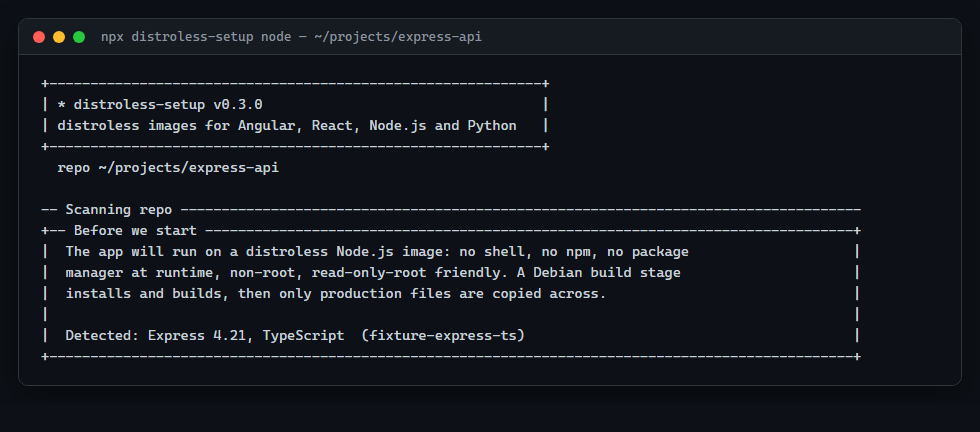
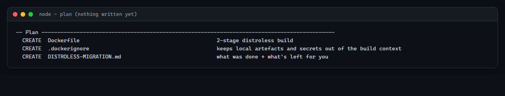
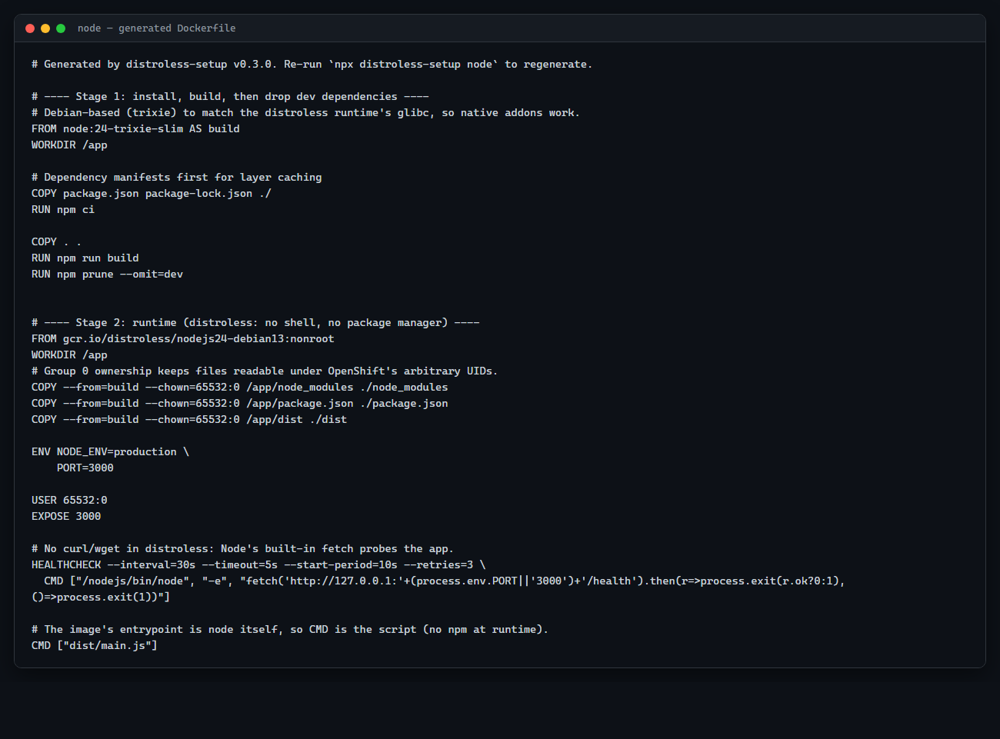
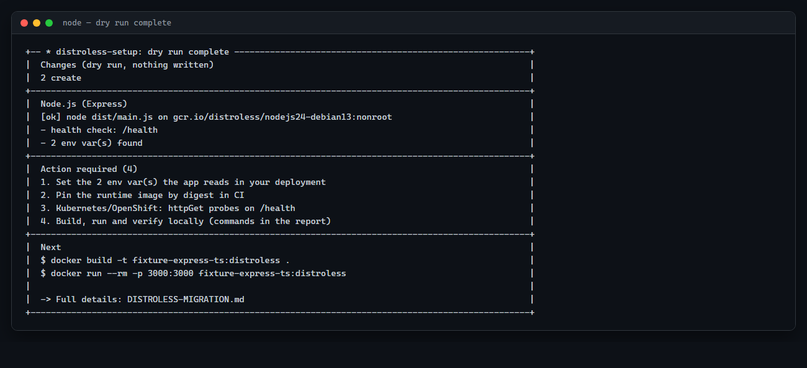
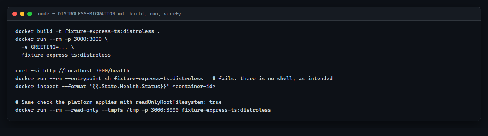

# Node.js walkthrough

This walkthrough follows `npx distroless-setup node` end to end on a real TypeScript Express
service — the exact fixture the tool's own container integration tests build and run
(`test/fixtures/node-express-ts` in this repository). Express is used as the primary,
coherent example; framework-specific notes for NestJS, Next.js, Fastify, Koa and Hono follow
at the end, since their runtime path is largely the same.

## What you'll do

Run the CLI against a Node.js/TypeScript service, answer its questions, review the plan,
apply it, then build, run and verify the resulting container image.

## What you'll end up with

A two-stage `Dockerfile`: a Debian build stage installs dependencies, compiles TypeScript
and prunes dev dependencies; the runtime stage is `gcr.io/distroless/nodejs<major>-debian13`
— no shell, no npm, no package manager, non-root, running your compiled JavaScript directly
with `node`.

## Before you start

**Node.js is both the build and the runtime technology here** — unlike Angular and React,
where Node only exists to produce static files. This is the key difference to keep in mind
throughout this stack: the final image *is* a running Node.js process, not a static file
server.

You'll need Node.js 18.17+ to run the CLI itself and Docker to build/run the image.

## 1. Prepare your project

No preparation needed — the tool reads `package.json`, your build config and your source for
entry-point, port and environment-variable detection. Nothing is written until you confirm.

## 2. Run distroless-setup

```bash
npx distroless-setup node
```

or `npx distroless-setup node --dry-run` to preview without writing. Aliases `nest`,
`express`, `next`, `nestjs`, `nextjs` all route to the same `node` stack if you'd rather name
your framework directly.

## 3. Understand each CLI question

### Detection

```
╭── Before we start ─────────────────────────────────────────────╮
│ The app will run on a distroless Node.js image: no shell, no   │
│ npm, no package manager at runtime, non-root, read-only-root   │
│ friendly. A Debian build stage installs and builds, then only  │
│ production files are copied across.                             │
│                                                                    │
│ Detected: Express 4.21, TypeScript  (fixture-express-ts)         │
╰────────────────────────────────────────────────────────────────────╯
  ? Continue with Express? [Y/n]:
```



If your repo looks like a monorepo/workspace (a `workspaces` field, `pnpm-workspace.yaml`,
`turbo.json` or `nx.json`), you're warned: this version targets one service per run — run it
inside the service's own folder.

### Node.js version

```
? Node.js major version (22 / 24 / 26): [24]
```

distroless publishes Node `22`, `24` and `26`. The default comes from `.nvmrc`,
`.node-version`, or `package.json#engines.node` if any of those pin a version; otherwise it
falls back to `24`. If your project pins a version distroless doesn't publish, the tool warns
and rounds up to the nearest one it does.

### Build stage

| Prompt | What it's asking | Recommended | Change this when | What happens |
|---|---|---|---|---|
| `Build-stage image (Debian trixie, to match the runtime)` | Which image compiles/installs | `node:<major>-trixie-slim` | Almost never — see the warning below | First `FROM` line |
| `Dependency install command` | Installs `node_modules` | The detected default (`npm ci`) | Custom install flags | Install `RUN` line |
| `Build command (blank = no build step)` | Compiles TypeScript, bundles, etc. | `npm run build` if `package.json` has a `build` script, else blank | You need a different build invocation | The build `RUN` line, if any |
| `Command that removes dev dependencies after the build` | Shrinks `node_modules` before it's copied to the runtime stage | The package manager's own default (`npm prune --omit=dev` here) | Your prune step needs extra flags | Runs right after the build, still inside the build stage |

> [!WARNING]
> If you pick an Alpine build image, the tool warns you: Alpine uses **musl**, while the
> distroless runtime is Debian (**glibc**)-based. A native addon compiled on Alpine will
> crash on the glibc runtime. Stick to `-trixie-slim` unless you're certain nothing in your
> dependency tree compiles native code.

### Runtime layout

For a plain Node/TypeScript/Express/NestJS project, the tool looks for an entry point in
this order: a `start:prod`/`start`/`serve`/`prod` script that runs plain `node` (not a dev
runner like `ts-node`/`tsx`/`nodemon`), then `nest-cli.json`, then `package.json#main`, then
your `tsconfig` `outDir` plus a conventional file name, then a handful of common filenames.

```
  • entry point: dist/main.js ("start:prod" script)
? Entry file, run as `node <file>`: [dist/main.js]
```

For the fixture, `package.json` has `"start:prod": "node dist/main.js"`, so that's the
detected entry, with high confidence. If your only `start` script runs through `ts-node` or
similar, the tool flags it: **distroless runs compiled JavaScript directly with plain
`node`** — there's no dev runner in the runtime image to fall back on.

```
? Paths to copy into the runtime image ('.' = the whole app), comma-separated: [dist]
```

Defaults to the build output folder (`dist`, `build`, etc.) plus any runtime-needed folders
it finds alongside it (`public`, `views`, `templates`, `static`, `locales`, `assets`). If
there's no build step, it defaults to `.` — the whole app, since there's nothing to prune to.

### Port and health check

```
  • app port 3000 is privileged; non-root needs >=1024   (only shown if a hard-coded port <1024 was found)
? Container port (set as PORT): [3000]
  • health endpoint found: /health
? Health check path ('none' = no HEALTHCHECK): [/health]
```

The fixture reads `process.env.PORT || 3000`, so `3000` is both the detected app port and
the container port default — they're the same prompt when a `PORT` env var read is found. A
**hard-coded** port with no env-var fallback is flagged as an action item, because the
container always sets `PORT` to whatever you chose here; if the app ignores it, the two will
disagree.

If no health endpoint is found, declining to enter `none` gets you a framework-appropriate
snippet in the report (an Express route, a NestJS controller, a Fastify handler) rather than
a guess baked into the Dockerfile.

### Runtime image

```
? Runtime base image: [gcr.io/distroless/nodejs24-debian13:nonroot]
? Pin it by digest? paste sha256:... (blank = tag only):
```

Same digest-pinning question as every other stack — see [the Angular
guide](angular.md#runtime-image-and-server) for what it does.

## 4. Review the proposed changes

```
── Plan ──────────────────────────────────────────────────────
  CREATE   Dockerfile              2-stage distroless build
  CREATE   .dockerignore           keeps local artefacts and secrets out of the build context
  CREATE   DISTROLESS-MIGRATION.md what was done + what's left for you
```



A Node.js migration never edits your source — only the Dockerfile, `.dockerignore` and
report. (Next.js is the one exception: see [Next.js
specifically](#nextjs-specifically) below.)

## 5. Apply the migration

```
? Apply this plan? [Y/n]:
```

## 6. Understand the generated files

| File | Why it exists |
|---|---|
| `Dockerfile` | Debian build stage → distroless/nodejs runtime, two stages total |
| `.dockerignore` | Keeps `node_modules`, `.next`, `dist`, `.env*` and key files out of the build context |
| `DISTROLESS-MIGRATION.md` | Project-specific actions, environment variables found, and deployment guidance |

### The Dockerfile, stage by stage

```
Your source
    │
    ▼
Stage 1 — build (node:24-trixie-slim, Debian: glibc-compatible with the runtime)
    │ npm ci
    │ npm run build        (tsc, here)
    │ npm prune --omit=dev
    ▼
Stage 2 — runtime (gcr.io/distroless/nodejs24-debian13:nonroot)
      contains: node_modules (production only), package.json, dist/
      entrypoint is `node` itself — no npm, no shell
```

The actual generated `Dockerfile` for this fixture:

```dockerfile
# Generated by distroless-setup v0.3.0. Re-run `npx distroless-setup node` to regenerate.

# ---- Stage 1: install, build, then drop dev dependencies ----
# Debian-based (trixie) to match the distroless runtime's glibc, so native addons work.
FROM node:24-trixie-slim AS build
WORKDIR /app

# Dependency manifests first for layer caching
COPY package.json package-lock.json ./
RUN npm ci

COPY . .
RUN npm run build
RUN npm prune --omit=dev


# ---- Stage 2: runtime (distroless: no shell, no package manager) ----
FROM gcr.io/distroless/nodejs24-debian13:nonroot
WORKDIR /app
COPY --from=build --chown=65532:0 /app/node_modules ./node_modules
COPY --from=build --chown=65532:0 /app/package.json ./package.json
COPY --from=build --chown=65532:0 /app/dist ./dist

ENV NODE_ENV=production \
    PORT=3000

USER 65532:0
EXPOSE 3000

# No curl/wget in distroless: Node's built-in fetch probes the app.
HEALTHCHECK --interval=30s --timeout=5s --start-period=10s --retries=3 \
  CMD ["/nodejs/bin/node", "-e", "fetch('http://127.0.0.1:'+(process.env.PORT||'3000')+'/health').then(r=>process.exit(r.ok?0:1),()=>process.exit(1))"]

# The image's entrypoint is node itself, so CMD is the script (no npm at runtime).
CMD ["dist/main.js"]
```



**Why `npm start` is not used at runtime:** the distroless Node image's entrypoint is `node`
itself — there is no `npm` binary in it at all. `CMD` names the compiled script directly.
Anything your `start` script did beyond `node <file>` (env loading, running migrations,
chaining commands with `&&`) has to move into the build stage, into the app's own startup
code, or into a separate Job — it won't run implicitly at container start.

> [!NOTE]
> **Health check**: `HEALTHCHECK` tells Docker to periodically run a command *inside* the
> container — here, Node's built-in `fetch` hitting `/health` — and mark the container
> `healthy` or `unhealthy` based on the result. That's stronger evidence than "the process is
> running": a deadlocked event loop still has a running process but fails its own check.
> Plain Docker/Compose read this line directly; Kubernetes and OpenShift **ignore** it and
> need their own `livenessProbe`/`readinessProbe` instead — `DISTROLESS-MIGRATION.md`
> generates that block for you (see [Deploying](#12-deploying-from-here)).

### `process.env` and configuration

The fixture reads two variables through `process.env`:

| Variable | When it's read |
|---|---|
| `GREETING` | runtime |
| `PORT` | runtime |

Set these with `-e`, Compose's `environment:`, or Kubernetes `env`/`envFrom`. Unlike the
build-time variables you'll see in the React guide, changing a Node.js runtime variable only
needs a container **restart**, not a rebuild — the value is read fresh by `process.env` each
time the process starts.

### SIGTERM and graceful shutdown

Node runs as **PID 1** inside the container, which changes signal handling: PID 1 doesn't
get the default handler behaviour a normal process gets, so without an explicit handler, a
`SIGTERM` (which Docker and Kubernetes send on shutdown) can kill the process immediately
instead of letting it finish in-flight requests. The fixture already handles this:

```ts
for (const signal of ["SIGTERM", "SIGINT"] as const) {
  process.on(signal, () => {
    console.log(`${signal} received, closing server`);
    server.close(() => process.exit(0));
  });
}
```

Because this was detected, it doesn't appear as an action item. If your app has no such
handler (and isn't NestJS, which gets its own check — see below), the report tells you to add
one.

### Native/system-library and shell-usage warnings

The scan flags dependencies known to need more than distroless ships — Puppeteer and
Playwright (bundle/need a browser and system libraries; run them in a separate,
non-distroless service), `canvas` (needs cairo/pango), and notes on `sharp`, `bcrypt`,
`argon2`, `better-sqlite3` and `@prisma/client` (these generally *work*, with caveats spelled
out in the report). It also flags code that shells out (`exec`/`spawn` to `sh`, `curl`,
`git`, `ffmpeg`, and similar) since there's no shell or those binaries at runtime. Neither
warning applies to this fixture.

Here's what the tool's closing summary looks like once the dry run finishes:



## 7. Build the image

```bash
docker build -t fixture-express-ts:distroless .
```

## 8. Run it locally

```bash
docker run --rm -p 3000:3000 \
  -e GREETING="Hello from distroless" \
  fixture-express-ts:distroless
```

## 9. Verify it

```bash
curl -si http://localhost:3000/health

docker run --rm --entrypoint sh fixture-express-ts:distroless   # fails: no shell, as intended
docker inspect --format '{{.State.Health.Status}}' <container-id>

# The image writes nothing outside /tmp:
docker run --rm --read-only --tmpfs /tmp -p 3000:3000 fixture-express-ts:distroless
```

These are the exact commands `DISTROLESS-MIGRATION.md` lists under **Build, run, verify**:



## 10. Understand what changed at runtime

- No `npm`, no shell, no package manager — only `node`, your compiled JavaScript and
  production `node_modules`.
- **Non-root**: the process runs as UID `65532`, GID `0` instead of the default `root`. If
  the app were ever compromised, running as non-root limits what the attacker's code can do
  inside the container — no installing packages, no modifying files it doesn't own, no
  relying on container-breakout techniques that need root. `65532:0` also works unmodified
  under OpenShift's arbitrary-UID model.
- `/tmp` is the one writable path every Node.js image gets by default, for anything Node
  itself might need; Next.js's standalone/`next start` modes additionally need
  `/app/.next/cache` writable (see below).

## 11. Read DISTROLESS-MIGRATION.md

For this fixture, **Action required** is:

1. Set `GREETING` (and any other env vars found) in your deployment manifests.
2. Pin the runtime image by digest in CI.
3. Add Kubernetes/OpenShift `httpGet` probes on `/health`.
4. Build, run and verify locally.

A project with a hard-coded port, no SIGTERM handler, a flagged native dependency, or shell
usage would see those as additional, earlier action items — each with the specific file and
line found.

## 12. Deploying from here

Same `securityContext` + `httpGet` probe block as the other stacks, generated for the port
and health path your project actually uses. If your service uses Prisma, a Yarn Classic
install with `@prisma/client`, or `.npmrc` registry tokens, the report calls those out
specifically (Yarn Classic's `--ignore-scripts` prune can skip Prisma's generated client;
`.npmrc` tokens should move to a BuildKit secret mount rather than being baked into a layer).

## Framework notes

The primary walkthrough above is deliberately Express, kept coherent rather than branching
into five separate tutorials. Everything below is what changes for other frameworks — the
runtime path (distroless/nodejs, two build stages, `node` as entrypoint) is otherwise
identical.

### Express

Exactly as walked through above.

### NestJS

- Entry point comes from `nest-cli.json`'s `entryFile` (default `main`) plus the TypeScript
  `outDir`, rather than a `start:prod` script.
- If no SIGTERM handling is detected, the suggested fix is specifically
  `app.enableShutdownHooks()` in `main.ts`, so Nest's own lifecycle hooks close connections
  cleanly instead of the process being killed after the grace period.
- A missing health endpoint gets a NestJS-flavoured snippet (a small `@Controller('health')`
  class, or `@nestjs/terminus`).
- Runtime path is otherwise identical to Express — same base image, same
  `CMD ["dist/main.js"]` shape, same production prune. It isn't part of the container
  integration test suite for that reason (see the [verification
  matrix](../../README.md#what-is-actually-verified) in the README) — only entry-point
  discovery differs, and that's unit tested.

### Fastify, Koa, Hono

Detected the same way, same generated Dockerfile shape as Express, with a
framework-appropriate health-endpoint snippet if none is found. Also outside the container
integration matrix, for the same reason as NestJS.

### Next.js specifically

Next.js is the one Node.js sub-path that can edit your source. The tool checks
`next.config.*` for `output: 'standalone'`:

- **Already set to `"standalone"`**: nothing to ask; the image uses it.
- **Not set**: you're offered `output: 'standalone'` (recommended) or running `next start` on
  full production `node_modules` instead, shown as a diff before you confirm.
- **Set to `"export"`**: the tool stops. That's a fully static site needing no Node.js
  runtime at all — not handled by this version; serve the `out/` folder with any static
  server instead.

**Why standalone mode:** `next build` with `output: 'standalone'` traces exactly which files
the server needs and copies only those into `.next/standalone` — no full `node_modules` in
the image, a much smaller runtime layer, and no dependency pruning step needed. The generated
Dockerfile copies `.next/standalone`, `.next/static`, and `public/` (if present) into the
runtime image and runs `node server.js`.

**Cache and write concerns:** Next.js writes its ISR/image-optimisation cache to
`.next/cache`. With `readOnlyRootFilesystem: true`, that path needs a mounted `emptyDir` — the
report calls this out and the generated `writablePaths` includes `/app/.next/cache`
alongside `/tmp`.

**`NEXT_PUBLIC_*` build-time behaviour:** exactly like React's `VITE_*`/`REACT_APP_*`, values
prefixed `NEXT_PUBLIC_` are inlined into the client bundle by `next build`. Setting them on
the running container does nothing to already-built client code; pass them as build args (or
read them server-side, at request time, without the prefix, if they only need to be
available on the server).

## Common questions / troubleshooting

**My app is a monorepo/workspace.** Run the tool from inside the specific service's folder,
and double-check the build command it proposes — v1 targets one service per run.

**A dependency needs system libraries.** Puppeteer, Playwright, `canvas` and similar aren't
fixed by this tool; they need a different, non-distroless base image or a separate service.
The report explains why for each one found.

## Re-running or undoing the migration

Re-running regenerates the `Dockerfile`; for Next.js, it won't re-prompt if
`output: 'standalone'` is already set. To undo: restore any updated files from
`.distroless-backup/<timestamp>/`, then delete the files the run created.

## What this walkthrough does not cover

- Database migrations, background workers, or any process other than the single HTTP
  service the Dockerfile runs.
- Monorepo build orchestration beyond running the tool inside one service's folder.
- Deployment-platform specifics beyond the generated `securityContext` and probes.

## Next steps

- Read the [root README](../../README.md#nodejs) for the full reference, including the
  exact checks run for every framework.
- If your Node service talks to a React or Angular frontend, walk through those with the
  [React](react.md) or [Angular](angular.md) guide.
- Python service in the same system? See the [Python walkthrough](python.md).
