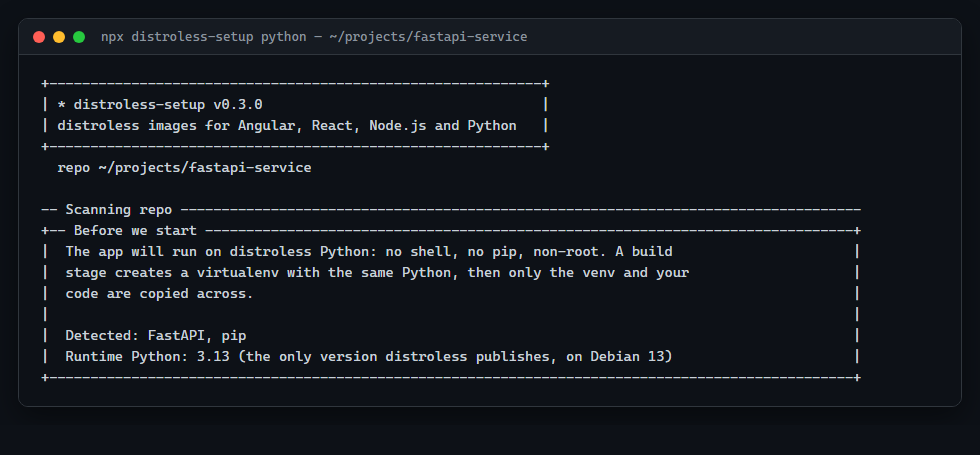
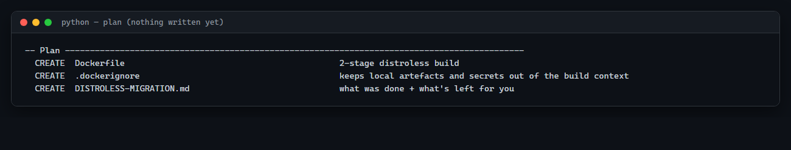
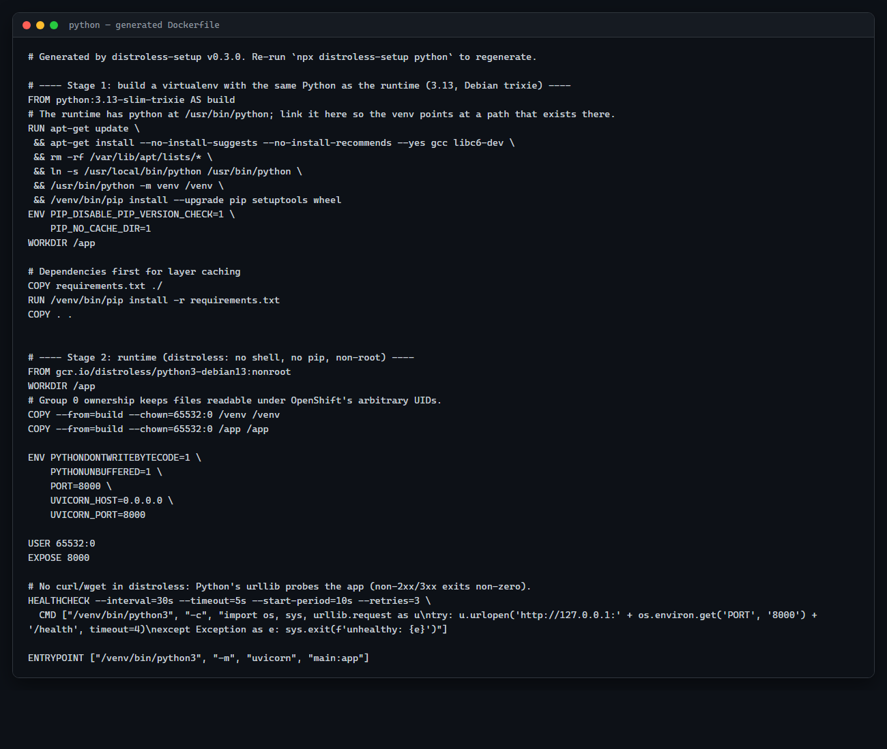
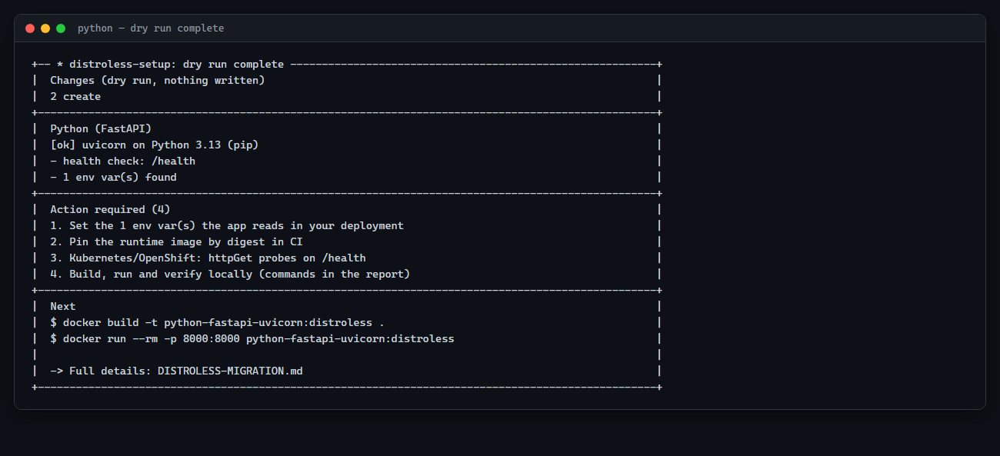
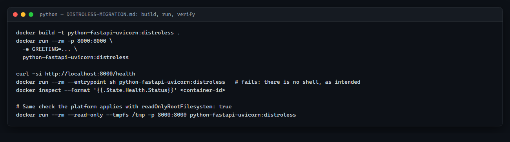

# Python walkthrough

This walkthrough follows `npx distroless-setup python` end to end on a real FastAPI service
served by uvicorn — the exact fixture the tool's own container integration tests build and
run (`test/fixtures/python-fastapi-uvicorn` in this repository). FastAPI gives the simplest
beginner flow; notes for Flask, Django, and the other dependency managers (uv, Poetry,
Pipenv) follow at the end.

## What you'll do

Run the CLI against a Python service, answer its questions, review the plan, apply it, then
build, run and verify the resulting container image.

## What you'll end up with

A two-stage `Dockerfile`: a build stage creates a virtual environment using the *same*
Python version as the runtime, installs your dependencies into it, then the runtime stage —
`gcr.io/distroless/python3-debian13:nonroot` — copies in only that virtualenv and your code.
No shell, no `pip`, non-root.

## Before you start

**Node.js is only needed to run the `distroless-setup` CLI itself** — it's a Node program.
It has no bearing on how your Python project runs; the generated image contains no Node.js
at all, only Python and your virtualenv.

You'll need Node.js 18.17+ to run the CLI and Docker to build/run the image.

> [!IMPORTANT]
> **distroless publishes exactly one Python version: 3.13**, on Debian 13 ("trixie"). If your
> project pins a different version (`requires-python`, `.python-version`, `Pipfile`, or
> similar), the tool tells you up front and asks you to confirm before continuing anyway.
> This isn't a packaging tutorial about supporting multiple Python versions — it's one
> specific, tested version, matched exactly between build and runtime stages so your
> virtualenv works unmodified in both.

## 1. Prepare your project

No preparation needed — the tool reads your dependency files (`pyproject.toml`,
`requirements*.txt`, `Pipfile`, `setup.py`) and source for framework, entry-point and
environment-variable detection. Nothing is written until you confirm.

## 2. Run distroless-setup

```bash
npx distroless-setup python
```

or `npx distroless-setup python --dry-run` first. Aliases `py`, `fastapi`, `django`, `flask`
all route to the same stack.

## 3. Understand each CLI question

### Detection and Python version

```
╭── Before we start ─────────────────────────────────────────────╮
│ The app will run on distroless Python: no shell, no pip,       │
│ non-root. A build stage creates a virtualenv with the same     │
│ Python, then only the venv and your code are copied across.    │
│                                                                    │
│ Detected: FastAPI, pip                                           │
│ Runtime Python: 3.13 (the only version distroless publishes, on  │
│ Debian 13)                                                        │
╰────────────────────────────────────────────────────────────────────╯
  ? Continue with FastAPI on Python 3.13? [Y/n]:
```



If a version spec in your project (`requires-python = ">=3.11,<3.13"`, for example) doesn't
accept 3.13, the panel turns yellow and a warning names exactly which file said so — the
default answer then flips to "no" so you don't continue past it by accident.

### Build stage

```
? Build-stage image (must be Python 3.13 on Debian trixie): [python:3.13-slim-trixie]
? Install a C compiler in the build stage (for packages without prebuilt wheels)? [Y/n]:
```

| Prompt | What it's asking | Recommended | Change this when | What happens |
|---|---|---|---|---|
| `Build-stage image` | Which image builds the virtualenv | `python:3.13-slim-trixie` | Almost never — it must match the runtime's Python | Warned if it isn't 3.13; mismatches break the venv |
| `Install a C compiler` | Whether `gcc`/`libc6-dev` get installed in the build stage | **Yes**, unless every dependency ships prebuilt wheels for your platform | You know your dependency tree is 100% pure-Python or pre-built wheels | Adds an `apt-get install gcc libc6-dev` line, removed again in the same `RUN` so it doesn't bloat a layer |

For `pip`-based projects with more than one `requirements*.txt`, you're also asked **which
file lists the production dependencies** (defaulting away from anything named `dev`/`test`/
`lint`/`doc` when there's a choice).

### How the app runs

```
  • app: main:app (FastAPI() in main.py)
? Application (module:attr): [main:app]
```

The tool searches your source for a `FastAPI()`/`Flask()`/`Starlette()` construction (or a
Flask `create_app()` factory, or Django's WSGI module via `manage.py`) and proposes the
`module:attribute` target uvicorn/gunicorn/etc. would use to import it.

```
? Production server (uvicorn / gunicorn + uvicorn workers / hypercorn / granian): [uvicorn]
```

| What it's asking | Recommended | Change this when | What happens |
|---|---|---|---|---|
| Which process serves the app | Whatever's already in your dependencies — the tool defaults to the one it can see installed (here, `uvicorn` alone, since `gunicorn` isn't in `requirements.txt`) | You need process-manager features (worker recycling, `--workers N`) that plain uvicorn doesn't have | Sets `ENTRYPOINT`; a server not in your dependency file gets an action item asking you to add it |

> [!NOTE]
> **WSGI vs. ASGI, at the level that matters here**: ASGI (used by FastAPI, Starlette) can
> handle async request handlers and things like WebSockets; WSGI (used by Flask, Django by
> default) is the older, synchronous-only interface. This only matters for which server can
> run your app at all — uvicorn and hypercorn speak ASGI, plain Gunicorn workers speak WSGI.
> That's why **Gunicorn + an ASGI app needs an extra worker class** (see next).

### Gunicorn + uvicorn workers

If you pick "gunicorn + uvicorn workers" for an ASGI app (FastAPI/Starlette), the generated
`ENTRYPOINT` uses `-k uvicorn_worker.UvicornWorker` — the standalone
[`uvicorn-worker`](https://github.com/Kludex/uvicorn-worker) package, **not**
`uvicorn.workers`. Uvicorn deprecated its bundled worker module in 0.30 and will remove it;
if your code or config still references `uvicorn.workers`, that's flagged as an action item
with the exact file and line to fix.

### Port and health check

```
? Container port (set as PORT): [8000]
  • health endpoint found: /health
? Health check path ('none' = no HEALTHCHECK): [/health]
```

Same shape as the other stacks. `/health` in the fixture's `main.py` is detected
automatically:

```python
@app.get("/health")
def health() -> dict:
    return {"status": "ok", "uid": os.getuid(), "gid": os.getgid(), ...}
```

### Runtime image

```
? Runtime base image: [gcr.io/distroless/python3-debian13:nonroot]
? Pin it by digest? paste sha256:... (blank = tag only):
```

## 4. Review the proposed changes

```
── Plan ──────────────────────────────────────────────────────
  CREATE   Dockerfile              2-stage distroless build
  CREATE   .dockerignore           keeps local artefacts and secrets out of the build context
  CREATE   DISTROLESS-MIGRATION.md what was done + what's left for you
```



## 5. Apply the migration

```
? Apply this plan? [Y/n]:
```

## 6. Understand the generated files

| File | Why it exists |
|---|---|
| `Dockerfile` | Build stage (venv + dependencies) → distroless/python3 runtime |
| `.dockerignore` | Keeps `.venv`, `__pycache__`, `.env*`, `*.sqlite3` and caches out of the build context |
| `DISTROLESS-MIGRATION.md` | Project-specific actions, environment variables found, and deployment guidance |

### The Dockerfile, stage by stage

```
Your source
    │
    ▼
Stage 1 — build (python:3.13-slim-trixie)
    │ ln -s /usr/local/bin/python /usr/bin/python   (matches the runtime's path)
    │ /usr/bin/python -m venv /venv
    │ /venv/bin/pip install -r requirements.txt
    ▼
Stage 2 — runtime (gcr.io/distroless/python3-debian13:nonroot)
      contains: /venv (the whole virtualenv) + /app (your code)
      no pip, no shell, no apt
```

The actual generated `Dockerfile` for this fixture:

```dockerfile
# Generated by distroless-setup v0.3.0. Re-run `npx distroless-setup python` to regenerate.

# ---- Stage 1: build a virtualenv with the same Python as the runtime (3.13, Debian trixie) ----
FROM python:3.13-slim-trixie AS build
# The runtime has python at /usr/bin/python; link it here so the venv points at a path that exists there.
RUN apt-get update \
 && apt-get install --no-install-suggests --no-install-recommends --yes gcc libc6-dev \
 && rm -rf /var/lib/apt/lists/* \
 && ln -s /usr/local/bin/python /usr/bin/python \
 && /usr/bin/python -m venv /venv \
 && /venv/bin/pip install --upgrade pip setuptools wheel
ENV PIP_DISABLE_PIP_VERSION_CHECK=1 \
    PIP_NO_CACHE_DIR=1
WORKDIR /app

# Dependencies first for layer caching
COPY requirements.txt ./
RUN /venv/bin/pip install -r requirements.txt
COPY . .


# ---- Stage 2: runtime (distroless: no shell, no pip, non-root) ----
FROM gcr.io/distroless/python3-debian13:nonroot
WORKDIR /app
COPY --from=build --chown=65532:0 /venv /venv
COPY --from=build --chown=65532:0 /app /app

ENV PYTHONDONTWRITEBYTECODE=1 \
    PYTHONUNBUFFERED=1 \
    PORT=8000 \
    UVICORN_HOST=0.0.0.0 \
    UVICORN_PORT=8000

USER 65532:0
EXPOSE 8000

# No curl/wget in distroless: Python's urllib probes the app (non-2xx/3xx exits non-zero).
HEALTHCHECK --interval=30s --timeout=5s --start-period=10s --retries=3 \
  CMD ["/venv/bin/python3", "-c", "import os, sys, urllib.request as u\ntry: u.urlopen('http://127.0.0.1:' + os.environ.get('PORT', '8000') + '/health', timeout=4)\nexcept Exception as e: sys.exit(f'unhealthy: {e}')"]

ENTRYPOINT ["/venv/bin/python3", "-m", "uvicorn", "main:app"]
```



**Why the symlink:** the distroless Python image provides its interpreter at
`/usr/bin/python`. The build stage's own Python is at `/usr/local/bin/python` (the standard
location in the upstream `python:3.13-slim-trixie` image), so a symlink is created *before*
the venv is built, meaning the venv's recorded interpreter path is the one that actually
exists in the runtime image.

**`ENTRYPOINT` uses exec form, and there is no shell to expand `$PORT`.** That's why the
port appears as a literal number (`8000`) baked into the command, rather than
`$PORT` — a distroless image has nothing to interpret shell syntax. To change the port,
re-run the tool or edit the Dockerfile directly.

> [!NOTE]
> **Health check**: `HEALTHCHECK` tells Docker to periodically run a command *inside* the
> container — here, Python's `urllib` hitting `/health` — and mark the container `healthy`
> or `unhealthy` based on the result. That's stronger evidence than "the process is running":
> a deadlocked worker still has a running process but fails its own check. Plain
> Docker/Compose read this line directly; Kubernetes and OpenShift **ignore** it and need
> their own `livenessProbe`/`readinessProbe` instead — `DISTROLESS-MIGRATION.md` generates
> that block for you (see [Deploying](#12-deploying-from-here)).

Here's what the tool's closing summary looks like once the dry run finishes:



## 7. Build the image

```bash
docker build -t python-fastapi-uvicorn:distroless .
```

## 8. Run it locally

```bash
docker run --rm -p 8000:8000 \
  -e GREETING="Hello from distroless" \
  python-fastapi-uvicorn:distroless
```

## 9. Verify it

```bash
curl -si http://localhost:8000/health

docker run --rm --entrypoint sh python-fastapi-uvicorn:distroless   # fails: no shell, as intended
docker inspect --format '{{.State.Health.Status}}' <container-id>

# The image writes nothing outside /tmp:
docker run --rm --read-only --tmpfs /tmp -p 8000:8000 python-fastapi-uvicorn:distroless
```

These are the exact commands `DISTROLESS-MIGRATION.md` lists under **Build, run, verify**:



## 10. Understand what changed at runtime

- No `pip`, no shell, no `apt` — only the Python interpreter, your virtualenv, and your code.
- **Non-root**: the process runs as UID `65532`, GID `0` instead of the default `root`. If
  the app were ever compromised, running as non-root limits what the attacker's code can do
  inside the container — no installing packages, no modifying files it doesn't own, no
  relying on container-breakout techniques that need root. `65532:0` also works unmodified
  under OpenShift's arbitrary-UID model.
- `PYTHONDONTWRITEBYTECODE=1` — the app never writes `.pyc` files, which matters under a
  read-only root filesystem.
- `/tmp` is the one writable path by default, for temp files or uploads if your app needs
  them.

## 11. Read DISTROLESS-MIGRATION.md

For this fixture, **Action required** is:

1. Set `GREETING` in your deployment manifests.
2. Pin the runtime image by digest in CI.
3. Add Kubernetes/OpenShift `httpGet` probes on `/health`.
4. Build, run and verify locally.

A project using a system-library-dependent package (`psycopg2`, `mysqlclient`, and similar),
`shell=True`/`os.system`, or Django's `collectstatic` would see additional, specific action
items — see the notes below.

## 12. Deploying from here

Same `securityContext` + `httpGet` probe block as the other stacks. If you picked Gunicorn,
the report also notes that it binds `0.0.0.0:$PORT` by default and keeps its worker heartbeat
in `/dev/shm` — which Docker and Kubernetes mount writable by default, so it works fine under
a read-only root without an extra volume. Tune worker count with the `GUNICORN_CMD_ARGS`
environment variable.

## Framework and dependency-manager notes

### Dependency managers

| Manager | Detected by | Build-stage command |
|---|---|---|
| **pip** | `requirements*.txt` | `pip install -r <file>` (you pick which file, if more than one) |
| **uv** | `uv.lock` | `uv sync --frozen --no-dev` — uv never downloads its own Python here; it installs straight into `/venv` |
| **Poetry** | `poetry.lock`, or `[tool.poetry]` in `pyproject.toml` | `poetry install --only main --no-root` |
| **Pipenv** | `Pipfile` | `pipenv requirements` piped into `pip install -r` |
| **pip (pyproject/setup.py)** | a `[project]` table or `setup.py`, no lock file | `pip install .` |

### Flask

WSGI, synchronous. The server prompt offers `gunicorn` (default, if installed), `uvicorn
(ASGI)` — yes, Flask can run under an ASGI shim, but this is unusual — `waitress`, or
`granian`. A `create_app()` factory is detected the same way a module-level `Flask()`
instance is.

### Django

Django gets its own set of questions and checks, layered on top of the ones above:

- **WSGI discovery**: the app target comes from `manage.py`'s
  `DJANGO_SETTINGS_MODULE` and the matching `<project>/wsgi.py`.
- **`collectstatic`**: if `STATIC_ROOT` is set in your settings, you're asked whether to run
  `manage.py collectstatic --noinput` during the build (there's no shell at runtime to run it
  later). If [WhiteNoise](https://whitenoise.readthedocs.io/) isn't already a dependency, the
  report suggests it (or a CDN/ingress) — Django itself doesn't serve static files in
  production.
- **Build-time settings for `collectstatic`**: if it fails during `docker build` because your
  settings require env vars that aren't set yet (like `SECRET_KEY`), the report shows how to
  give it harmless build-only values: `RUN SECRET_KEY=build-only /venv/bin/python manage.py
  collectstatic --noinput`.
- **Migrations**: always pointed at a separate Kubernetes Job or init container using the
  same image (`command: ["/venv/bin/python3", "manage.py", "migrate"]`) — there's no shell
  for a start script that migrates first, and running migrations from every replica on
  startup is a race condition waiting to happen regardless.
- Checked reminders: set `ALLOWED_HOSTS`, `DEBUG=False` and `SECRET_KEY` from the
  environment in production settings.

### Native/system-library and shell-usage warnings

Flagged when found: `psycopg2` (use `psycopg2-binary` or `psycopg[binary]` instead — plain
`psycopg2` links against `libpq`, which distroless doesn't ship), `mysqlclient` (use
`PyMySQL`), `python-ldap`, `weasyprint`, `opencv-python` (use the `-headless` variant),
`pdf2image`/`pytesseract` (shell out to binaries distroless doesn't have), and a few others —
each with a one-line explanation of the fix in the report. Code using `shell=True`,
`os.system`, or `subprocess` calls to `sh`/`curl`/`git`/`ffmpeg` is flagged the same way,
since none of those exist at runtime.

## Common questions / troubleshooting

**My `requires-python` doesn't allow 3.13 — what now?** Test your app on 3.13 and update the
constraint if it works; distroless publishes only that one version, so there's no way to
target a different one with this tool.

**Why does the report mention `/dev/shm`?** Only if you chose Gunicorn: its worker heartbeat
file lives there, and container runtimes mount `/dev/shm` writable by default even under
`--read-only`, so it needs no extra configuration.

**I use hypercorn/waitress/granian and want to change the port later.** Since there's no
shell to expand an env var in `ENTRYPOINT`, re-run the tool with the new port (or edit the
Dockerfile's `ENTRYPOINT` line by hand) rather than trying to override it with `-e PORT=...`
alone — uvicorn and Gunicorn read `PORT`/`UVICORN_PORT` at startup, but the other three are
started with a fixed value baked into the command.

## Re-running or undoing the migration

Re-running regenerates the Dockerfile from your current answers. To undo: restore any
updated files from `.distroless-backup/<timestamp>/`, then delete the files the run created.

## What this walkthrough does not cover

- Python packaging in general — dependency manager choice, `src/` layouts and packaging
  metadata are assumed to already work locally; the tool containerises what's there.
- Database setup, connection pooling, or running migrations automatically at startup (the
  report deliberately steers you away from that).
- Every combination of framework, dependency manager and server — see the [verification
  matrix](../../README.md#what-is-actually-verified) in the README for exactly what's
  container-tested versus generation-tested only.

## Next steps

- Read the [root README](../../README.md#python) for the full reference.
- Python service behind a React or Angular frontend? See the [React](react.md) or
  [Angular](angular.md) guide.
- Sibling Node.js service in the same system? See the [Node.js walkthrough](node.md).
