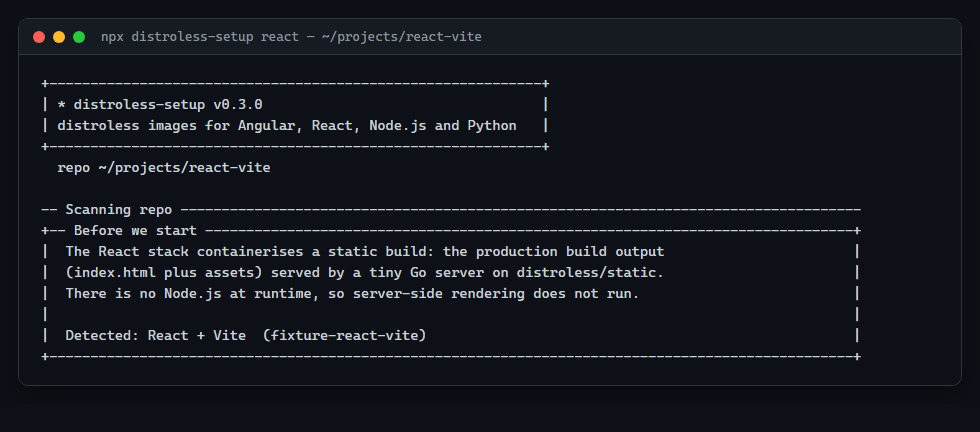
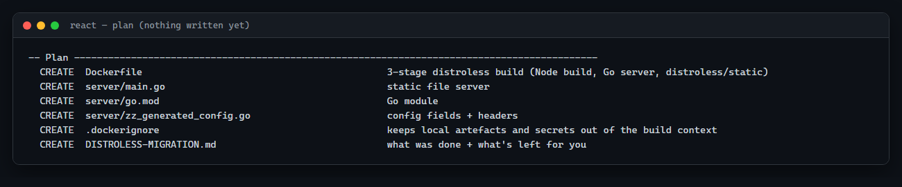
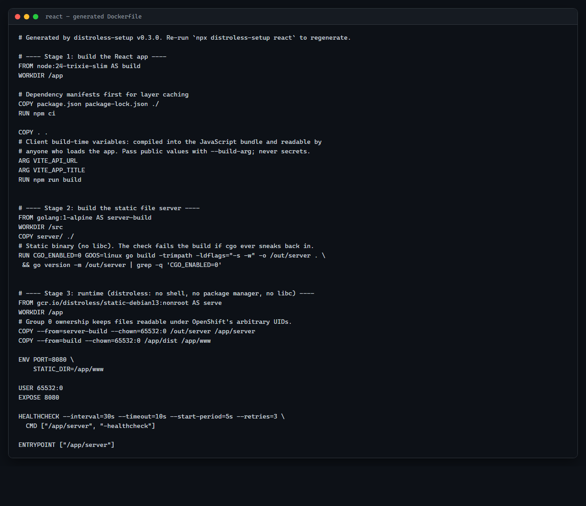
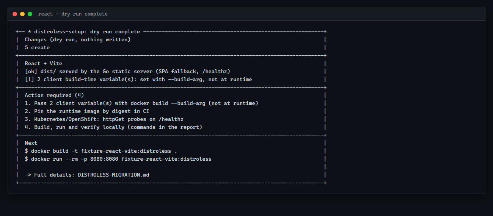
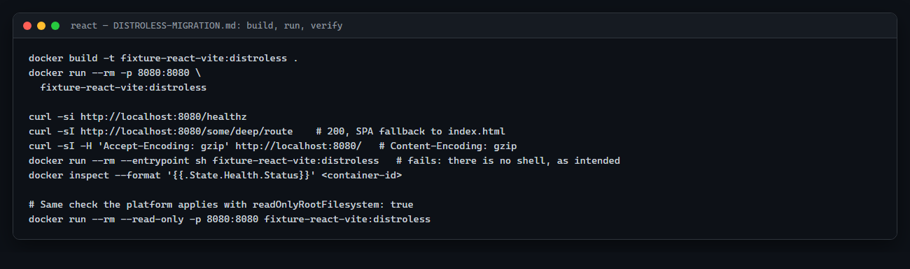

# React walkthrough

This walkthrough follows `npx distroless-setup react` end to end on a real React + Vite
application with TypeScript and React Router client routes — the exact fixture project the
tool's own container integration tests build and run
(`test/fixtures/react-vite` in this repository). Vite is the primary, container-tested React
path; this guide also covers where React Router (framework, SPA mode) and Create React App
differ, and why Next.js isn't part of this stack at all.

## What you'll do

Run the CLI against a React app, answer its questions, review the plan, apply it, then
build, run and verify the resulting container image.

## What you'll end up with

A multi-stage `Dockerfile`: a Node.js build stage runs your production build, and the same
small Go static file server used by the [Angular stack](angular.md) serves the output on
`gcr.io/distroless/static-debian13:nonroot`. The final image has no Node.js, no
`node_modules`, and no shell.

## Before you start

You'll need Node.js 18.17+ to run the CLI and Docker to build/run the image. A terminal in
your React project's root (where `package.json` lives) is all the setup required.

> [!NOTE]
> **Static build**: this stack only serves a pre-built folder of files — `index.html` plus
> hashed JS/CSS/asset files — the same thing a CDN would serve. There is no server-side
> rendering, no Node.js process, and no per-request React code running in the image. If your
> app needs a server at request time, it isn't a fit for this stack (more on this below).

## 1. Prepare your project

No preparation needed. The tool reads `package.json`, your build config, and your source
files for environment-variable reads; nothing is written until you approve a plan.

## 2. Run distroless-setup

```bash
npx distroless-setup react
```

or with `--dry-run` first to see the plan without writing anything. Auto-detection also
works (`npx distroless-setup`) — a `react`/`react-dom` dependency plus a recognisable build
setup is enough for high confidence, unless a server framework or Angular is also present.

## 3. Understand each CLI question

### Detection and framework confirmation

```
╭── Before we start ──────────────────────────────────────────────╮
│ The React stack containerises a static build: the production    │
│ build output (index.html plus assets) served by a tiny Go       │
│ server on distroless/static. There is no Node.js at runtime, so │
│ server-side rendering does not run.                              │
│                                                                    │
│ Detected: React + Vite  (fixture-react-vite)                     │
╰────────────────────────────────────────────────────────────────────╯
  ? Continue setting up a distroless image for this React app? [Y/n]:
```



The banner names which of four build tools it detected — **React + Vite**, **React Router
(framework, SPA mode)**, **Create React App**, or a generic **React (unrecognised builder)**
path. If it's a **Next.js**, **Remix** or **Gatsby** project, the tool stops and tells you
why (see [Static-only boundary](#static-only-boundary-and-frameworks-this-stack-doesnt-cover)
below) rather than guessing.

### Build stage

| Prompt | What it's asking | Recommended | Change this when | What happens |
|---|---|---|---|---|
| `Dependency install command` | Installs `node_modules` in the build stage | The detected default (`npm ci` here) | Custom install flags | The Dockerfile's install `RUN` line |
| `Node image for the build stage` | Which Node image runs the build | The detected major on `-trixie-slim` (Debian, not Alpine — see note below) | Rare: you need Alpine-only tooling | First `FROM` line; this Node.js never ships |
| `Build command` | The exact command that produces the static output | Your `package.json`'s `build` script if it has one (`npm run build`, which for this fixture runs `tsc && vite build`) | You need extra build flags | The Dockerfile's build `RUN` line |
| `Build output directory (contains index.html)` | Where the build writes its static files | Read from `vite.config.*` (`build.outDir`, `root`) when they're plain strings, else `dist` | Vite's config computes the value dynamically (the tool can't read it statically) and got it wrong | This folder is `COPY`'d into the runtime image as the web root |

> [!NOTE]
> React's build-stage Node image defaults to `-trixie-slim` (Debian), while Angular's
> defaults to `-alpine`. Both work for their respective build tools; the difference simply
> reflects each stack's own default, not a hard requirement — you can change either.

If the output directory can't be read from your build tool's configuration (a dynamic value,
or a builder the tool doesn't specifically recognise), it warns you and asks you to confirm
the folder that will contain the built `index.html`.

### Client build-time variables — the most important section for React

The fixture's `src/App.tsx` reads:

```tsx
const apiUrl = import.meta.env.VITE_API_URL ?? "(VITE_API_URL not set at build time)";
// ...
<h1>{import.meta.env.VITE_APP_TITLE}</h1>
```

The tool scans every source file (`import.meta.env.VITE_*`, `process.env.REACT_APP_*`, and
`%VITE_*%`/`%REACT_APP_*%` in `index.html`) and reports what it found:

```
  • client build-time variables: VITE_API_URL, VITE_APP_TITLE
```

> [!IMPORTANT]
> **`VITE_*` and `REACT_APP_*` are build-time values, not runtime configuration.** The
> bundler replaces every reference to them with a literal string while producing the
> JavaScript bundle. Understand this before you rely on it:
>
> - **You pass them as Docker build args**, not container env vars:
>   `docker build --build-arg VITE_API_URL=https://api.example.com .`. The Dockerfile
>   declares an `ARG` for every one the scan found.
> - **A different value needs a different image.** Setting `VITE_API_URL` on an
>   already-running container does **nothing** — the JavaScript was already compiled with
>   whatever value (or lack of one) was present at `docker build` time.
> - **Every value is public.** Anyone who loads the app can read it straight out of the
>   downloaded JavaScript, in plain text, using their browser's dev tools. Never put an API
>   secret, password or private key in a `VITE_*` or `REACT_APP_*` variable.
> - This release does **not** add runtime configuration to React apps the way it does for
>   Angular. If you need per-environment values without a rebuild, the app itself has to
>   fetch them at runtime (e.g. `fetch('/config.json')` on startup) — that's your own code to
>   add, not something this tool generates for React today.

Names that look like a credential (matching `SECRET`, `PASSWORD`, `TOKEN`, `API_KEY`, and
similar patterns) are flagged as the **first** action item in the report — move them out of
the client bundle before shipping.

### Security headers, port and runtime image

Identical in shape to the Angular walkthrough's [equivalent
section](angular.md#security-headers) and [runtime image
questions](angular.md#runtime-image-and-server): security headers (carried over from an
existing nginx config if one exists), container port, runtime base image (with optional
digest pinning), the Go builder image, and the folder for the generated server source.

### Cleanup

If migrating from an existing nginx-based setup, the tool finds `nginx.conf` and
`docker-entrypoint*` scripts, reproduces what it can (headers, the SPA fallback, the listen
port) and lists what it can't (`proxy_pass`, TLS termination, rewrites, and any
`envsubst`/`sed` startup scripts that rewrote files at container start — those can't run
without a shell). It only offers to remove the files by default when none of that
non-portable behaviour was found; otherwise it asks, defaulting to "leave them in place" so
you can review first.

## 4. Review the proposed changes

```
── Plan ──────────────────────────────────────────────────────
  CREATE   Dockerfile          3-stage distroless build (Node build, Go server, distroless/static)
  CREATE   server/main.go      static file server
  CREATE   server/go.mod       Go module
  CREATE   server/zz_generated_config.go   config fields + headers
  CREATE   .dockerignore       keeps local artefacts and secrets out of the build context
  CREATE   DISTROLESS-MIGRATION.md   what was done + what's left for you
```



Nothing in your React source is ever rewritten — React apps get no code changes, only the
Dockerfile and server.

## 5. Apply the migration

```
? Apply this plan? [Y/n]:
```

## 6. Understand the generated files

| File | Why it exists |
|---|---|
| `Dockerfile` | Node build stage → Go build stage → distroless/static runtime |
| `.dockerignore` | Keeps `node_modules`, the build output folder, `.env*` and key/cert files out of the build context |
| `server/main.go`, `server/go.mod` | The shared static file server (identical source to Angular's) |
| `server/zz_generated_config.go` | Your project's security headers (no runtime-config fields for React — that field list is always empty here) |
| `DISTROLESS-MIGRATION.md` | Project-specific actions and deployment guidance |

### The Dockerfile, stage by stage

```
Your source
    │
    ▼
Stage 1 — Node build stage (node:24-trixie-slim)
    │ npm ci
    │ ARG VITE_API_URL, ARG VITE_APP_TITLE   (declared per variable found)
    │ npm run build  ->  tsc && vite build
    │ produces dist/ (static HTML/CSS/JS, content-hashed filenames)
    ▼
Stage 2 — Go build stage (golang:1-alpine)
    │ compiles server/*.go
    ▼
Stage 3 — runtime (gcr.io/distroless/static-debian13:nonroot)
      contains only: the Go binary + dist/
      no Node.js, no npm, no shell
```

The actual generated `Dockerfile` for this fixture:

```dockerfile
# Generated by distroless-setup v0.3.0. Re-run `npx distroless-setup react` to regenerate.

# ---- Stage 1: build the React app ----
FROM node:24-trixie-slim AS build
WORKDIR /app

# Dependency manifests first for layer caching
COPY package.json package-lock.json ./
RUN npm ci

COPY . .
# Client build-time variables: compiled into the JavaScript bundle and readable by
# anyone who loads the app. Pass public values with --build-arg; never secrets.
ARG VITE_API_URL
ARG VITE_APP_TITLE
RUN npm run build


# ---- Stage 2: build the static file server ----
FROM golang:1-alpine AS server-build
WORKDIR /src
COPY server/ ./
RUN CGO_ENABLED=0 GOOS=linux go build -trimpath -ldflags="-s -w" -o /out/server . \
 && go version -m /out/server | grep -q 'CGO_ENABLED=0'

# ---- Stage 3: runtime (distroless: no shell, no package manager, no libc) ----
FROM gcr.io/distroless/static-debian13:nonroot AS serve
WORKDIR /app
COPY --from=server-build --chown=65532:0 /out/server /app/server
COPY --from=build --chown=65532:0 /app/dist /app/www

ENV PORT=8080 \
    STATIC_DIR=/app/www

USER 65532:0
EXPOSE 8080

HEALTHCHECK --interval=30s --timeout=10s --start-period=5s --retries=3 \
  CMD ["/app/server", "-healthcheck"]

ENTRYPOINT ["/app/server"]
```



> [!NOTE]
> **Health check**: `HEALTHCHECK` tells Docker to periodically run a command *inside* the
> container — here, the server binary probing its own `/healthz` — and mark the container
> `healthy` or `unhealthy` based on the exit code. That's stronger evidence than "the process
> is running": a hung server still has a running process but fails its own check. Plain
> Docker/Compose read this line directly; Kubernetes and OpenShift ignore it and need their
> own `livenessProbe`/`readinessProbe` instead, which `DISTROLESS-MIGRATION.md` generates for
> you (see [Deploying](#12-deploying-from-here)).

### Hashed vs. unhashed asset caching

The same server that serves Angular serves React, with the same cache policy: a file whose
name carries a content hash (`index-BWoJ4fK0.js`, `main.8e3f1a2b.js` — Vite/Rollup, esbuild
and webpack hashing schemes are all recognised) is served
`Cache-Control: public, max-age=31536000, immutable`, because a changed file always gets a
new name. Everything else — `favicon.ico`, anything copied from `public/` verbatim — is
served `Cache-Control: no-cache`, so a browser revalidates it on every use instead of caching
it indefinitely under an unchanging name.

Here's what the tool's closing summary looks like once the dry run finishes:



## 7. Build the image

```bash
docker build -t fixture-react-vite:distroless \
  --build-arg VITE_API_URL=https://api.example.com \
  --build-arg VITE_APP_TITLE="My App" \
  .
```

## 8. Run it locally

```bash
docker run --rm -p 8080:8080 fixture-react-vite:distroless
```

Nothing else to pass — there's no runtime configuration for React apps in this release.

## 9. Verify it

```bash
curl -sI http://localhost:8080/some/deep/route    # 200, SPA fallback to index.html
curl -sI -H 'Accept-Encoding: gzip' http://localhost:8080/   # Content-Encoding: gzip
curl -si http://localhost:8080/healthz

docker run --rm --entrypoint sh fixture-react-vite:distroless   # fails: no shell, as intended
docker inspect --format '{{.State.Health.Status}}' <container-id>

# readOnlyRootFilesystem, with no writable mounts at all needed:
docker run --rm --read-only -p 8080:8080 fixture-react-vite:distroless
```

These are the exact commands `DISTROLESS-MIGRATION.md` lists under **Build, run, verify**:



## 10. Understand what changed at runtime

No Node.js, `node_modules`, npm, or shell exist in the final image — only the compiled Go
binary and your static build output, running as UID `65532` / GID `0` instead of the default
`root` (**non-root**). If the server binary were ever compromised, running as non-root means
it has no permission to install anything, modify files it doesn't own, or lean on
container-breakout techniques that assume root — it's confined to exactly what UID `65532`
can touch. Because `VITE_*`/`REACT_APP_*` are baked in at build time, there is nothing left
for the container to read at startup beyond the port it listens on.

## 11. Read DISTROLESS-MIGRATION.md

For this fixture, **Action required** is short:

1. Pass `VITE_API_URL`, `VITE_APP_TITLE` with `docker build --build-arg` — setting them on
   the running container changes nothing.
2. Pin the runtime image by digest in CI.
3. Add Kubernetes/OpenShift `httpGet` probes on `/healthz`.
4. Build, run and verify locally (exact commands included).

The report also has a **Client build-time variables** table (which file first referenced
each one) and, if applicable, a **Base path** section and a **Replaced nginx setup** section
listing anything not reproduced.

## 12. Deploying from here

Same shape as Angular's [Deploying](angular.md#12-deploying-from-here) section: a
`securityContext` and `httpGet` probes ready to paste into your manifests. Because a
different `VITE_*`/`REACT_APP_*` value means a different image, plan your CI so that
per-environment builds happen at `docker build` time (one image per environment, or per
config combination you need) rather than trying to parameterise a single image at deploy
time.

## Common questions / troubleshooting

**React Router SPA mode.** If your project uses `@react-router/dev` (the framework package,
not just the `react-router` library), the tool checks `react-router.config.*` for
`ssr: false`. React Router's *framework* mode defaults to server rendering, which is a
different deployment (a Node server has to run every request) — not a fit for this static
stack. With `ssr: false` set explicitly, the client build in `build/client` is a complete
static SPA, and this stack handles it exactly like the Vite path above. If `ssr` is missing,
`true`, or set to a value the tool can't read statically, it explains this and stops unless
you confirm the client output really is a complete, servable build on its own — if your app
relies on server loaders or actions, it will not work from this image. For a React Router
app that does need SSR, containerise it with `npx distroless-setup node` instead.

**Create React App.** Detected from a `react-scripts` dependency, output in `build/`,
variables read as `process.env.REACT_APP_*`. CRA is deprecated upstream; this stack still
supports it for existing projects, but don't start a new one on it — prefer Vite.

**Base path other than `/`.** A Vite `base`, CRA `homepage`, or React Router `basename` other
than `/` is reported, not rewritten: the container always serves from `/`. Your ingress has
to strip the prefix before forwarding; an ingress that keeps the prefix isn't supported by
this stack's server.

### Static-only boundary and frameworks this stack doesn't cover

- **Next.js** belongs to the [Node.js stack](node.md) — run `npx distroless-setup node`
  instead. The React stack refuses outright rather than guessing at a Next.js static export.
- **Remix** and **Gatsby**: detected and named, but since their production deployments can
  depend on framework-specific hosting features (redirects, serverless functions, server
  rendering), the tool asks you to confirm the build output really is a plain static folder
  before treating it that way. If you can't confirm that, it aborts.
- **React Router SSR**, custom SSR servers, and React Server Components deployments are not
  handled by this stack at all.

## Re-running or undoing the migration

Re-running is safe and idempotent for the files this stack generates
(`Dockerfile`, `server/*`). To undo: restore any updated/removed files from
`.distroless-backup/<timestamp>/`, then delete the files the run created.

## What this walkthrough does not cover

- Server-side rendering for any React framework — see the [Node.js guide](node.md).
- Adding your own runtime configuration mechanism to a React app (not generated by this
  tool today).
- CDN/edge deployment specifics beyond what a single container needs.

## Next steps

- Read the [root README](../../README.md#react) for the full React reference, including the
  exact detection rules and confidence scoring between builders.
- The [Angular walkthrough](angular.md) covers the shared static server in more depth,
  including its cache and SPA-fallback behaviour.
- If your React app calls an API you also own, walk through it with the
  [Node.js](node.md) or [Python](python.md) guide.
